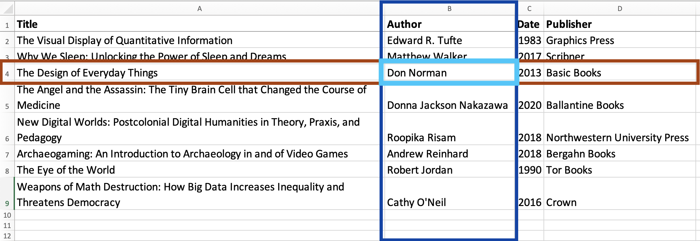
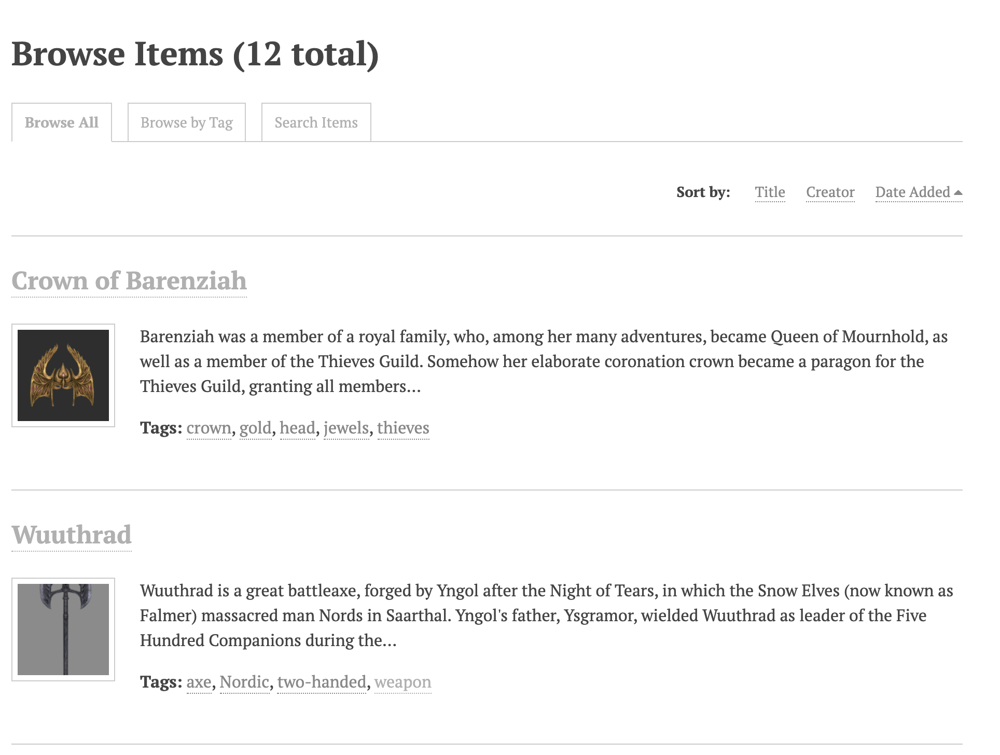

Spreadsheets are a wonderful tool for gathering, viewing, sharing, and working with information. As with any tool, learning to use them effectively can make a big difference. In this tutorial we will discuss the structure of an effective spreadsheet, how to deal with certain tricky values you may work with, and some other tips and features for working with spreadsheets.

!!!! ## Learning Objectives
!!!!
!!!! - Describe the basic structure of a spreadsheet.
!!!! - Determine how to organize a complicated dataset.
!!!! - Avoid common pitfalls when creating tables or spreadsheets.
!!!! - Handle tricky information, like dates and null or unknown values.

## Spreadsheet Structure

We will look at several sample spreadsheets to see how we can organize different types of information. Before we look at anything too complex, however, we need to define the basic "data structure" of a spreadsheet.

The Book Sample spreadsheet is a very basic example of standard table listing books.

!!! A quick note on terminology: I am using spreadsheet and table interchangeably here, since a well-organized spreadsheet is a table.

<table>
    <caption>Book Sample</caption>
    <thead>
        <tr>
            <th>Title</th>
            <th>Author</th>
            <th>Date</th>
            <th>Publisher</th>
        </tr>
    </thead>
    <tbody>
        <tr>
            <td>The Visual Display of Quantitative Information</td>
            <td>Edward R. Tufte</td>
            <td>1983</td>
            <td>Graphics Press</td>
        </tr>
      <tr>
        <td>Why We Sleep</td>
        <td>Matthew Walker</td>
        <td>2017</td>
        <td>Scribner</td>
      </tr>
      <tr>
        <td>The Design of Everyday Things</td>
        <td>Don Norman</td>
        <td>2013</td>
        <td>Basic Books</td>
      </tr>
      <tr>
        <td>The Angel and the Assassin</td>
        <td>Donna Jackson Nakazawa</td>
        <td>2020</td>
        <td>Ballantine Books</td>
      </tr>
      <tr>
        <td>New Digital Worlds</td>
        <td>Roopika Risam</td>
        <td>2018</td>
        <td>Northwestern University Press</td>
      </tr>
      <tr>
        <td>The Eye of the World</td>
        <td>Robert Jordan</td>
        <td>1990</td>
        <td>Tor Books</td>
      </tr>
      <tr>
        <td>Weapons of Math Destruction</td>
        <td>Cathy O’Neil</td>
        <td>2016</td>
        <td>Crown</td>
      </tr>
    </tbody>
</table>

There are three components of table structure that are important to note: Columns, rows, and cells.

A column lists some variable, or type of information. In this sample, that information includes title, author, date, and publisher. We could create more columns if we wanted to collect other information about the books - number of pages, ISBN number, subject, and so forth - anything you can think of that you would want to record.

A row lists one observation, or one "item" that we are observing. That "item" could be anything from an observation from hands-on research to information about a concept or physical object. Often, as is the case here, the first row provides column headers instead. This is important for making it clear what each column contains. In this sample, the items we are listing are books, so each row will contain one (and only one) book. This is one of the essential rules for organized spreadsheets: Each row contains information for only one object.

Each intersection of a row and column is a cell. A cell contains the value of the variable specified by the column for the item specified by the row. For example, the cell highlighted here contains the information specified by the Author for the observation of the third item - the book The Design of Everyday Things. In other words, this cell states that the author of The Design of Everyday Things is Don Norman.

The standard rule here is that there should only ever be one value per cell. While this sample conforms to the rule, there is a potential problem area in the author column. You are probably familiar with lots of books and articles that have more than one author. If I want to add a book with multiple authors to this spreadsheet, I have to choose between ignoring all authors other than the first, having multiple authors (values) in a single cell, or restructuring the sheet. As we will see, the last option is typically the best choice, although it will likely take more work. That is why it is important to plan out what information you have and how you will organize it early!

! ### Key Points
!
! - One value per cell
! - One item per row

Another fairly common attribute that shares the same difficulty as author is the tag attribute. Tweets, photographs, artifacts... all kinds of things can have any number of tags. In the next example, we will take a look at how we can address this kind of issue when it comes up.

The Skyrim Museum Sample is a shortened and simplified version of some information that could be uploaded to the content management system Omeka. Omeka allows you to build a basic website with a searchable database containing images or other objects and their metadata (the information about those objects). It is commonly used for archives, and it works well for a variety of digital projects.

This is an image from the Omeka site showing two of the items it contains. (screenshot) If you are interested, you can [explore the Skyrim Museum site](https://theoacker.oucreate.com/skyrim-museum/items/browse) to get an idea of what Omeka can do.

This site features a collection of items from the video game Skyrim that would be classified as cultural heritage artifacts, at least if they existed in the real world. Our sample dataset contains a few of these items.

<table>
    <caption>Skyrim Museum Sample</caption>
  <thead>
    <tr>
      <th>Name</th>
      <th>Creator</th>
      <th>Date</th>
      <th>Original Format</th>
      <th>Tags</th>
    </tr>
  </thead>
  <tbody>
    <tr>
      <td>Rahgot</td>
      <td>Unknown dragons</td>
      <td>Merethic Era</td>
      <td>Game Object</td>
      <td>armor,dragons,enchanted,Nordic</td>
    </tr>
    <tr>
      <td>Golden Claw</td>
      <td>Unknown</td>
      <td>Unknown</td>
      <td>Game Object</td>
      <td>dragons,Nordic,puzzles</td>
    </tr>
    <tr>
      <td>Mehrunes' Razor</td>
      <td>Mehrunes Dagon</td>
      <td>Unknown</td>
      <td>Game Object</td>
      <td>Daedric,dagger,enchanted,one-handed,weapon</td>
    </tr>
    <tr>
      <td>Auriel's Bow</td>
      <td>Anuiel</td>
      <td>Dawn Era</td>
      <td>Game Object</td>
      <td>bow,enchanted,prophecy,two-handed,weapon</td>
    </tr>
    <tr>
      <td>Wuuthrad</td>
      <td>Yngol</td>
      <td>Merethic Era</td>
      <td>Game Object</td>
      <td>axe,Nordic,two-handed,weapon</td>
    </tr>
  </tbody>
</table>

In this dataset we have name, creator, date, original format, and tags. You may have noticed that the Tags column is breaking the rule of one value per cell. This illustrates one of the rare cases when it is good to break the rule. When uploading this data to Omeka, the Omeka importer will recognize the Tags column and separate out the list of tags as individual items. This means that the end result will not have all the tags mashed together like we see here.

That is great for importing data into Omeka. It is not so great for other potential uses. What if we want to analyze the data outside of Omeka using some other type of software? For a simple example, maybe we want to count how many objects have the "enchanted" tag. It is simple enough to count by hand, since this is such a tiny dataset. In a larger dataset however, I might have closer to five hundred items than five. With such a dataset, there would be no easy way to count the number of objects with any given tag.

Other potential avenues for analysis include:

- How many tags does each item have?
- What are the most common tags?
- Which tags tend to show up together?

With the current structure, we have no reasonable way to get this information.

So what is the solution?

#### Variable List of Generic Columns

The first option we will consider is adding a list of however many generic columns we end up needing, as shown below.

<table>
    <thead>
      <tr>
        <th>Name</th>
        <th>Creator</th>
        <th>Date</th>
        <th>Original Format</th>
        <th>Tag 1</th>
        <th>Tag 2</th>
        <th>Tag 3</th>
        <th>Tag 4</th>
        <th>Tag 5</th>
      </tr>
    </thead>
    <tbody>
      <tr>
        <td>Rahgot</td>
        <td>Unknown dragons</td>
        <td>Merethic Era</td>
        <td>Game Object</td>
        <td>armor</td>
        <td>dragons</td>
        <td>enchanted</td>
        <td>Nordic</td>
        <td></td>
      </tr>
      <tr>
        <td>Golden Claw</td>
        <td>Unknown</td>
        <td>Unknown</td>
        <td>Game Object</td>
        <td>dragons</td>
        <td>Nordic</td>
        <td>puzzles</td>
        <td></td>
        <td></td>
      </tr>
      <tr>
        <td>Mehrunes' Razor</td>
        <td>Mehrunes Dagon</td>
        <td>Unknown</td>
        <td>Game Object</td>
        <td>Daedric</td>
        <td>dagger</td>
        <td>enchanted</td>
        <td>one-handed</td>
        <td>weapon</td>
      </tr>
      <tr>
        <td>Auriel's Bow</td>
        <td>Anuiel</td>
        <td>Dawn Era</td>
        <td>Game Object</td>
        <td>bow</td>
        <td>enchanted</td>
        <td>prophecy</td>
        <td>two-handed</td>
        <td>weapon</td>
      </tr>
      <tr>
        <td>Wuuthrad</td>
        <td>Yngol</td>
        <td>Merethic Era</td>
        <td>Game Object</td>
        <td>axe</td>
        <td>Nordic</td>
        <td>two-handed</td>
        <td>weapon</td>
        <td></td>
      </tr>
    </tbody>
</table>

Here we have created five columns so that each tag is in its own cell and column. There are several major issues with this. First, the number of tags a given object has is variable. At the moment we only need five columns, since the most tags any of these items have is five, but we cannot count on that. We might end up with an item that has ten or even twenty tags. In addition, this structure does not help us at all in analyzing the data. Consider the "simple" question of how many objects have the "enchanted" tag. Again, it is easy enough to count by hand with a dataset of only five objects. If I had a larger dataset and wanted to use some software to find this number, however, it would be rather complicated to explain what I needed to the software. I would have to list out each tag column (Tag 1, Tag 2, Tag 3, and so on) and tell the program to check each of them, as "enchanted" could show up in any of them.

This might seem like a minor hassle with the data we have. Listing the five columns is only slightly annoying, but imagine if there were twenty columns instead, or if we wanted to make a chart showing how many times each tag shows up. While these are not the only issues, they are enough to indicate that this is **_not_** the solution.

#### Long List of Specific Columns

Our second option is a slightly different take on the first. We still create extra columns, but this time we create a specific column for each potential value. In this case, we need a column for each different tag used in the dataset.

<table>
    <thead>
      <tr>
        <th>Name</th>
        <th>Creator</th>
        <th>Date</th>
        <th>Original Format</th>
        <th>armor</th>
        <th>axe</th>
        <th>bow</th>
        <th>Daedric</th>
        <th>dagger</th>
        <th>dragons</th>
        <th>enchanted</th>
        <th>Nordic</th>
        <th>one-handed</th>
        <th>prophecy</th>
        <th>puzzles</th>
        <th>two-handed</th>
        <th>weapon</th>
      </tr>
    </thead>
    <tbody>
      <tr>
        <td>Rahgot</td>
        <td>Unknown dragons</td>
        <td>Merethic Era</td>
        <td>Game Object</td>
        <td>yes</td>
        <td>no</td>
        <td>no</td>
        <td>no</td>
        <td>no</td>
        <td>yes</td>
        <td>yes</td>
        <td>yes</td>
        <td>no</td>
        <td>no</td>
        <td>no</td>
        <td>no</td>
        <td>no</td>
      </tr>
      <tr>
        <td>Golden Claw</td>
        <td>Unknown</td>
        <td>Unknown</td>
        <td>Game Object</td>
        <td>no</td>
        <td>no</td>
        <td>no</td>
        <td>no</td>
        <td>no</td>
        <td>yes</td>
        <td>no</td>
        <td>yes</td>
        <td>no</td>
        <td>no</td>
        <td>yes</td>
        <td>no</td>
        <td>no</td>
      </tr>
      <tr>
        <td>Mehrunes' Razor</td>
        <td>Mehrunes Dagon</td>
        <td>Unknown</td>
        <td>Game Object</td>
        <td>no</td>
        <td>no</td>
        <td>no</td>
        <td>yes</td>
        <td>yes</td>
        <td>no</td>
        <td>yes</td>
        <td>no</td>
        <td>yes</td>
        <td>no</td>
        <td>no</td>
        <td>no</td>
        <td>yes</td>
      </tr>
      <tr>
        <td>Auriel's Bow</td>
        <td>Anuiel</td>
        <td>Dawn Era</td>
        <td>Game Object</td>
        <td>no</td>
        <td>no</td>
        <td>yes</td>
        <td>no</td>
        <td>no</td>
        <td>no</td>
        <td>yes</td>
        <td>no</td>
        <td>no</td>
        <td>yes</td>
        <td>no</td>
        <td>yes</td>
        <td>yes</td>
      </tr>
      <tr>
        <td>Wuuthrad</td>
        <td>Yngol</td>
        <td>Merethic Era</td>
        <td>Game Object</td>
        <td>no</td>
        <td>yes</td>
        <td>no</td>
        <td>no</td>
        <td>no</td>
        <td>no</td>
        <td>no</td>
        <td>yes</td>
        <td>no</td>
        <td>no</td>
        <td>no</td>
        <td>yes</td>
        <td>yes</td>
      </tr>
    </tbody>
</table>

This structure improves our ability to perform some types of analysis, though it causes issues with others. More importantly, however, this is simply not feasible. We have to add one column for each tag. With only five items, each of which has at most only five tags, we already have thirteen different possible tags. With a full dataset, we would have a lot more. There are some cases where adding specific columns like this is a good solution (we will see one in a different example), but this is clearly not one of those.

#### Multiple Spreadsheets

Finally, we have our only real option: Splitting the data into two different spreadsheets/tables.

The first table, Objects, contains all of the artifact information except for tags. In fact, it is literally the same table we started with, but with the Tags column removed.

<table>
    <caption>Objects</caption>
  <thead>
    <tr>
      <th>Name</th>
      <th>Creator</th>
      <th>Date</th>
      <th>Original Format</th>
    </tr>
  </thead>
  <tbody>
    <tr>
      <td>Rahgot</td>
      <td>Unknown dragons</td>
      <td>Merethic Era</td>
      <td>Game Object</td>
    </tr>
    <tr>
      <td>Golden Claw</td>
      <td>Unknown</td>
      <td>Unknown</td>
      <td>Game Object</td>
    </tr>
    <tr>
      <td>Mehrunes' Razor</td>
      <td>Mehrunes Dagon</td>
      <td>Unknown</td>
      <td>Game Object</td>
    </tr>
    <tr>
      <td>Auriel's Bow</td>
      <td>Anuiel</td>
      <td>Dawn Era</td>
      <td>Game Object</td>
    </tr>
    <tr>
      <td>Wuuthrad</td>
      <td>Yngol</td>
      <td>Merethic Era</td>
      <td>Game Object</td>
    </tr>
  </tbody>
</table>

We can then deal with the Tags column in a second spreadsheet. Here, each row pairs one object and one tag. Every object gets one row for each of its tags. For example, Auriel's Bow has five tags, so it gets five rows in this new table.

<table>
    <caption>Tags</caption>
    <thead>
      <tr>
        <th>Name</th>
        <th>Tag</th>
      </tr>
    </thead>
    <tbody>
      <tr>
        <td>Rahgot</td>
        <td>armor</td>
      </tr>
      <tr>
        <td>Rahgot</td>
        <td>dragons</td>
      </tr>
      <tr>
        <td>Rahgot</td>
        <td>enchanted</td>
      </tr>
      <tr>
        <td>Rahgot</td>
        <td>Nordic</td>
      </tr>
      <tr>
        <td>Golden Claw</td>
        <td>dragons</td>
      </tr>
      <tr>
        <td>Golden Claw</td>
        <td>Nordic</td>
      </tr>
      <tr>
        <td>Golden Claw</td>
        <td>puzzles</td>
      </tr>
      <tr>
        <td>Mehrunes' Razor</td>
        <td>Daedric</td>
      </tr>
      <tr>
        <td>Mehrunes' Razor</td>
        <td>dagger</td>
      </tr>
      <tr>
        <td>Mehrunes' Razor</td>
        <td>enchanted</td>
      </tr>
      <tr>
        <td>Mehrunes' Razor</td>
        <td>one-handed</td>
      </tr>
      <tr>
        <td>Mehrunes' Razor</td>
        <td>weapon</td>
      </tr>
      <tr>
        <td>Auriel's Bow</td>
        <td>bow</td>
      </tr>
      <tr>
        <td>Auriel's Bow</td>
        <td>enchanted</td>
      </tr>
      <tr>
        <td>Auriel's Bow</td>
        <td>prophecy</td>
      </tr>
      <tr>
        <td>Auriel's Bow</td>
        <td>two-handed</td>
      </tr>
      <tr>
        <td>Auriel's Bow</td>
        <td>weapon</td>
      </tr>
      <tr>
        <td>Wuuthrad</td>
        <td>axe</td>
      </tr>
      <tr>
        <td>Wuuthrad</td>
        <td>Nordic</td>
      </tr>
      <tr>
        <td>Wuuthrad</td>
        <td>two-handed</td>
      </tr>
      <tr>
        <td>Wuuthrad</td>
        <td>weapon</td>
      </tr>
    </tbody>
</table>

The two spreadsheet connect by using the artifact name. In the fifth row of the Tags table, we pair the Golden Claw with the dragons tag. Then we pair it with Nordic, and then with puzzles. Because the "Name" variable is unique to each of our objects - for example, we only have one object with the name Golden Claw - we can use this to clearly identify which object a given tag belongs to. There is no question that the three tags just mentioned (dragons, Nordic, puzzles) all belong to the object called Golden Claw.

### Survey Data

Our next example is a spreadsheet based on some actual survey data I worked with. I am providing two tables here - the short version, so you can view it more easily, and the long version.

<table>
    <caption>Survey Data - "Short" Version</caption>
    <thead>
      <tr>
        <th>HHID</th>
        <th>Year</th>
        <th>Month</th>
        <th>Day</th>
        <th>RegionCode</th>
        <th>Livestock</th>
        <th>Members</th>
        <th>ID_01</th>
        <th>ID_02</th>
        <th>ID_03</th>
        <th>ID_04</th>
        <th>ID_05</th>
        <th>ID_06</th>
        <th>ID_07</th>
        <th>ID_08</th>
        <th>ID_09</th>
        <th>ID_10</th>
        <th>ID_11</th>
        <th>ID_12</th>
        <th>Age_01</th>
      </tr>
    </thead>
    <tbody>
      <tr>
        <td>1</td>
        <td>2019</td>
        <td>3</td>
        <td>25</td>
        <td>15874</td>
        <td>1 poultry</td>
        <td>4</td>
        <td>1</td>
        <td>2</td>
        <td>3</td>
        <td>4</td>
        <td></td>
        <td></td>
        <td></td>
        <td></td>
        <td></td>
        <td></td>
        <td></td>
        <td></td>
        <td>34</td>
      </tr>
      <tr>
        <td>2</td>
        <td>2019</td>
        <td>3</td>
        <td>25</td>
        <td>15874</td>
        <td>2 cows, 1 ox</td>
        <td>4</td>
        <td>1</td>
        <td>2</td>
        <td>3</td>
        <td>4</td>
        <td></td>
        <td></td>
        <td></td>
        <td></td>
        <td></td>
        <td></td>
        <td></td>
        <td></td>
        <td>20</td>
      </tr>
      <tr>
        <td>3</td>
        <td>2019</td>
        <td>3</td>
        <td>27</td>
        <td>15874</td>
        <td>5 poultry, 2 cows, 2 goats, 1 ox</td>
        <td>4</td>
        <td>1</td>
        <td>2</td>
        <td>3</td>
        <td>4</td>
        <td></td>
        <td></td>
        <td></td>
        <td></td>
        <td></td>
        <td></td>
        <td></td>
        <td></td>
        <td>42</td>
      </tr>
      <tr>
        <td>4</td>
        <td>2019</td>
        <td>3</td>
        <td>28</td>
        <td>10553</td>
        <td>3 cows, 1 ox</td>
        <td>5</td>
        <td>1</td>
        <td>2</td>
        <td>3</td>
        <td>4</td>
        <td>5</td>
        <td></td>
        <td></td>
        <td></td>
        <td></td>
        <td></td>
        <td></td>
        <td></td>
        <td>40</td>
      </tr>
      <tr>
        <td>5</td>
        <td>2019</td>
        <td>3</td>
        <td>30</td>
        <td>10553</td>
        <td>1 goat</td>
        <td>2</td>
        <td>1</td>
        <td>2</td>
        <td></td>
        <td></td>
        <td></td>
        <td></td>
        <td></td>
        <td></td>
        <td></td>
        <td></td>
        <td></td>
        <td></td>
        <td>27</td>
      </tr>
      <tr>
        <td>6</td>
        <td>2019</td>
        <td>4</td>
        <td>2</td>
        <td>10553</td>
        <td>1 ox</td>
        <td>6</td>
        <td>1</td>
        <td>2</td>
        <td>3</td>
        <td>4</td>
        <td>5</td>
        <td>6</td>
        <td></td>
        <td></td>
        <td></td>
        <td></td>
        <td></td>
        <td></td>
        <td>30</td>
      </tr>
      <tr>
        <td>7</td>
        <td>2019</td>
        <td>4</td>
        <td>2</td>
        <td>10553</td>
        <td>1 goat, 1 ox</td>
        <td>4</td>
        <td>1</td>
        <td>2</td>
        <td>3</td>
        <td>4</td>
        <td></td>
        <td></td>
        <td></td>
        <td></td>
        <td></td>
        <td></td>
        <td></td>
        <td></td>
        <td>57</td>
      </tr>
      <tr>
        <td>8</td>
        <td>2019</td>
        <td>4</td>
        <td>2</td>
        <td>10553</td>
        <td>2 goats, 1 ox</td>
        <td>12</td>
        <td>1</td>
        <td>2</td>
        <td>3</td>
        <td>4</td>
        <td>5</td>
        <td>6</td>
        <td>7</td>
        <td>8</td>
        <td>9</td>
        <td>10</td>
        <td>11</td>
        <td>12</td>
        <td>67</td>
      </tr>
      <tr>
        <td>9</td>
        <td>2019</td>
        <td>4</td>
        <td>3</td>
        <td>10553</td>
        <td>2 oxen</td>
        <td>1</td>
        <td>1</td>
        <td></td>
        <td></td>
        <td></td>
        <td></td>
        <td></td>
        <td></td>
        <td></td>
        <td></td>
        <td></td>
        <td></td>
        <td></td>
        <td>65</td>
      </tr>
      <tr>
        <td>10</td>
        <td>2019</td>
        <td>4</td>
        <td>3</td>
        <td>14521</td>
        <td>1 cow, 2 goats</td>
        <td>3</td>
        <td>1</td>
        <td>2</td>
        <td>3</td>
        <td></td>
        <td></td>
        <td></td>
        <td></td>
        <td></td>
        <td></td>
        <td></td>
        <td></td>
        <td></td>
        <td>33</td>
      </tr>
    </tbody>
</table>

The first column is the HHID, the ID for each household. We also have columns for the year, month, and day the data was collected, a region code, a list of livestock owned by the household, and the number of members within the household. It is after this Members column that the data starts to get... interesting. Starting with the ID columns, information has been collected about each member of the household. The data in these columns relates not to the household in general, but only to one of the members within the household. ID-01 is the ID for the first member, ID_02 is the ID for the second member, and so on.

<table>
    <caption>Survey Sample</caption>
    <thead>
      <tr>
        <th>HHID</th>
        <th>Year</th>
        <th>Month</th>
        <th>Day</th>
        <th>RegionCode</th>
        <th>Livestock</th>
        <th>Members</th>
        <th>ID_01</th>
        <th>ID_02</th>
        <th>ID_03</th>
        <th>ID_04</th>
        <th>ID_05</th>
        <th>ID_06</th>
        <th>ID_07</th>
        <th>ID_08</th>
        <th>ID_09</th>
        <th>ID_10</th>
        <th>ID_11</th>
        <th>ID_12</th>
        <th>Age_01</th>
        <th>Age_02</th>
        <th>Age_03</th>
        <th>Age_04</th>
        <th>Age_05</th>
        <th>Age_06</th>
        <th>Age_07</th>
        <th>Age_08</th>
        <th>Age_09</th>
        <th>Age_10</th>
        <th>Age_11</th>
        <th>Age_12</th>
        <th>Sex_01</th>
        <th>Sex_02</th>
        <th>Sex_03</th>
        <th>Sex_04</th>
        <th>Sex_05</th>
        <th>Sex_06</th>
        <th>Sex_07</th>
        <th>Sex_08</th>
        <th>Sex_09</th>
        <th>Sex_10</th>
        <th>Sex_11</th>
        <th>Sex_12</th>
        <th>Mar_01</th>
        <th>Mar_02</th>
        <th>Mar_03</th>
        <th>Mar_04</th>
        <th>Mar_05</th>
        <th>Mar_06</th>
        <th>Mar_07</th>
        <th>Mar_08</th>
        <th>Mar_09</th>
        <th>Mar_10</th>
        <th>Mar_11</th>
        <th>Mar_12</th>
        <th>EduLvl_01</th>
        <th>EduLvl_02</th>
        <th>EduLvl_03</th>
        <th>EduLvl_04</th>
        <th>EduLvl_05</th>
        <th>EduLvl_06</th>
        <th>EduLvl_07</th>
        <th>EduLvl_08</th>
        <th>EduLvl_09</th>
        <th>EduLvl_10</th>
        <th>EduLvl_11</th>
        <th>EduLvl_12</th>
        <th>EduYr_01</th>
        <th>EduYr_02</th>
        <th>EduYr_03</th>
        <th>EduYr_04</th>
        <th>EduYr_05</th>
        <th>EduYr_06</th>
        <th>EduYr_07</th>
        <th>EduYr_08</th>
        <th>EduYr_09</th>
        <th>EduYr_10</th>
        <th>EduYr_11</th>
        <th>EduYr_12</th>
      </tr>
    </thead>
    <tbody>
      <tr>
        <td>1</td>
        <td>2019</td>
        <td>3</td>
        <td>25</td>
        <td>15874</td>
        <td>1 poultry</td>
        <td>4</td>
        <td>1</td>
        <td>2</td>
        <td>3</td>
        <td>4</td>
        <td></td>
        <td></td>
        <td></td>
        <td></td>
        <td></td>
        <td></td>
        <td></td>
        <td></td>
        <td>34</td>
        <td>24</td>
        <td>3</td>
        <td>1</td>
        <td></td>
        <td></td>
        <td></td>
        <td></td>
        <td></td>
        <td></td>
        <td></td>
        <td></td>
        <td>male</td>
        <td>female</td>
        <td>female</td>
        <td>male</td>
        <td></td>
        <td></td>
        <td></td>
        <td></td>
        <td></td>
        <td></td>
        <td></td>
        <td></td>
        <td>married</td>
        <td>married</td>
        <td></td>
        <td></td>
        <td></td>
        <td></td>
        <td></td>
        <td></td>
        <td></td>
        <td></td>
        <td></td>
        <td></td>
        <td>primary</td>
        <td>none</td>
        <td>none</td>
        <td>none</td>
        <td></td>
        <td></td>
        <td></td>
        <td></td>
        <td></td>
        <td></td>
        <td></td>
        <td></td>
        <td>2</td>
        <td>0</td>
        <td>0</td>
        <td>0</td>
        <td></td>
        <td></td>
        <td></td>
        <td></td>
        <td></td>
        <td></td>
        <td></td>
        <td></td>
      </tr>
      <tr>
        <td>2</td>
        <td>2019</td>
        <td>3</td>
        <td>25</td>
        <td>15874</td>
        <td>2 cows, 1 ox</td>
        <td>4</td>
        <td>1</td>
        <td>2</td>
        <td>3</td>
        <td>4</td>
        <td></td>
        <td></td>
        <td></td>
        <td></td>
        <td></td>
        <td></td>
        <td></td>
        <td></td>
        <td>20</td>
        <td>22</td>
        <td>2</td>
        <td>0</td>
        <td></td>
        <td></td>
        <td></td>
        <td></td>
        <td></td>
        <td></td>
        <td></td>
        <td></td>
        <td>male</td>
        <td>female</td>
        <td>female</td>
        <td>female</td>
        <td></td>
        <td></td>
        <td></td>
        <td></td>
        <td></td>
        <td></td>
        <td></td>
        <td></td>
        <td>married</td>
        <td>married</td>
        <td></td>
        <td></td>
        <td></td>
        <td></td>
        <td></td>
        <td></td>
        <td></td>
        <td></td>
        <td></td>
        <td></td>
        <td>secondary</td>
        <td>secondary</td>
        <td>none</td>
        <td>none</td>
        <td></td>
        <td></td>
        <td></td>
        <td></td>
        <td></td>
        <td></td>
        <td></td>
        <td></td>
        <td>8</td>
        <td>12</td>
        <td>0</td>
        <td>0</td>
        <td></td>
        <td></td>
        <td></td>
        <td></td>
        <td></td>
        <td></td>
        <td></td>
        <td></td>
      </tr>
      <tr>
        <td>3</td>
        <td>2019</td>
        <td>3</td>
        <td>27</td>
        <td>15874</td>
        <td>5 poultry, 2 cows, 2 goats, 1 ox</td>
        <td>4</td>
        <td>1</td>
        <td>2</td>
        <td>3</td>
        <td>4</td>
        <td></td>
        <td></td>
        <td></td>
        <td></td>
        <td></td>
        <td></td>
        <td></td>
        <td></td>
        <td>42</td>
        <td>36</td>
        <td>11</td>
        <td>4</td>
        <td></td>
        <td></td>
        <td></td>
        <td></td>
        <td></td>
        <td></td>
        <td></td>
        <td></td>
        <td>male</td>
        <td>female</td>
        <td>male</td>
        <td>male</td>
        <td></td>
        <td></td>
        <td></td>
        <td></td>
        <td></td>
        <td></td>
        <td></td>
        <td></td>
        <td>married</td>
        <td>married</td>
        <td></td>
        <td></td>
        <td></td>
        <td></td>
        <td></td>
        <td></td>
        <td></td>
        <td></td>
        <td></td>
        <td></td>
        <td>secondary</td>
        <td>secondary</td>
        <td>secondary</td>
        <td>none</td>
        <td></td>
        <td></td>
        <td></td>
        <td></td>
        <td></td>
        <td></td>
        <td></td>
        <td></td>
        <td>14</td>
        <td>12</td>
        <td>6</td>
        <td>0</td>
        <td></td>
        <td></td>
        <td></td>
        <td></td>
        <td></td>
        <td></td>
        <td></td>
        <td></td>
      </tr>
      <tr>
        <td>4</td>
        <td>2019</td>
        <td>3</td>
        <td>28</td>
        <td>10553</td>
        <td>3 cows, 1 ox</td>
        <td>5</td>
        <td>1</td>
        <td>2</td>
        <td>3</td>
        <td>4</td>
        <td>5</td>
        <td></td>
        <td></td>
        <td></td>
        <td></td>
        <td></td>
        <td></td>
        <td></td>
        <td>40</td>
        <td>39</td>
        <td>11</td>
        <td>6</td>
        <td>4</td>
        <td></td>
        <td></td>
        <td></td>
        <td></td>
        <td></td>
        <td></td>
        <td></td>
        <td>male</td>
        <td>female</td>
        <td>male</td>
        <td>female</td>
        <td>male</td>
        <td></td>
        <td></td>
        <td></td>
        <td></td>
        <td></td>
        <td></td>
        <td></td>
        <td>married</td>
        <td>married</td>
        <td></td>
        <td></td>
        <td></td>
        <td></td>
        <td></td>
        <td></td>
        <td></td>
        <td></td>
        <td></td>
        <td></td>
        <td>secondary</td>
        <td>none</td>
        <td>secondary</td>
        <td>primary</td>
        <td>none</td>
        <td></td>
        <td></td>
        <td></td>
        <td></td>
        <td></td>
        <td></td>
        <td></td>
        <td>6</td>
        <td>0</td>
        <td>6</td>
        <td>1</td>
        <td>0</td>
        <td></td>
        <td></td>
        <td></td>
        <td></td>
        <td></td>
        <td></td>
        <td></td>
      </tr>
      <tr>
        <td>5</td>
        <td>2019</td>
        <td>3</td>
        <td>30</td>
        <td>10553</td>
        <td>1 goat</td>
        <td>2</td>
        <td>1</td>
        <td>2</td>
        <td></td>
        <td></td>
        <td></td>
        <td></td>
        <td></td>
        <td></td>
        <td></td>
        <td></td>
        <td></td>
        <td></td>
        <td>27</td>
        <td>16</td>
        <td></td>
        <td></td>
        <td></td>
        <td></td>
        <td></td>
        <td></td>
        <td></td>
        <td></td>
        <td></td>
        <td></td>
        <td>male</td>
        <td>female</td>
        <td></td>
        <td></td>
        <td></td>
        <td></td>
        <td></td>
        <td></td>
        <td></td>
        <td></td>
        <td></td>
        <td></td>
        <td>married</td>
        <td>married</td>
        <td></td>
        <td></td>
        <td></td>
        <td></td>
        <td></td>
        <td></td>
        <td></td>
        <td></td>
        <td></td>
        <td></td>
        <td>secondary</td>
        <td>secondary</td>
        <td></td>
        <td></td>
        <td></td>
        <td></td>
        <td></td>
        <td></td>
        <td></td>
        <td></td>
        <td></td>
        <td></td>
        <td>12</td>
        <td>9</td>
        <td></td>
        <td></td>
        <td></td>
        <td></td>
        <td></td>
        <td></td>
        <td></td>
        <td></td>
        <td></td>
        <td></td>
      </tr>
      <tr>
        <td>6</td>
        <td>2019</td>
        <td>4</td>
        <td>2</td>
        <td>10553</td>
        <td>1 ox</td>
        <td>6</td>
        <td>1</td>
        <td>2</td>
        <td>3</td>
        <td>4</td>
        <td>5</td>
        <td>6</td>
        <td></td>
        <td></td>
        <td></td>
        <td></td>
        <td></td>
        <td></td>
        <td>30</td>
        <td>24</td>
        <td>1</td>
        <td>1</td>
        <td>59</td>
        <td>25</td>
        <td></td>
        <td></td>
        <td></td>
        <td></td>
        <td></td>
        <td></td>
        <td>male</td>
        <td>female</td>
        <td>female</td>
        <td>male</td>
        <td>male</td>
        <td>male</td>
        <td></td>
        <td></td>
        <td></td>
        <td></td>
        <td></td>
        <td></td>
        <td>married</td>
        <td>married</td>
        <td></td>
        <td></td>
        <td>married</td>
        <td>never</td>
        <td></td>
        <td></td>
        <td></td>
        <td></td>
        <td></td>
        <td></td>
        <td>primary</td>
        <td>primary</td>
        <td>none</td>
        <td>none</td>
        <td>primary</td>
        <td>primary</td>
        <td></td>
        <td></td>
        <td></td>
        <td></td>
        <td></td>
        <td></td>
        <td>5</td>
        <td>6</td>
        <td>0</td>
        <td>0</td>
        <td>4</td>
        <td>6</td>
        <td></td>
        <td></td>
        <td></td>
        <td></td>
        <td></td>
        <td></td>
      </tr>
      <tr>
        <td>7</td>
        <td>2019</td>
        <td>4</td>
        <td>2</td>
        <td>10553</td>
        <td>1 goat, 1 ox</td>
        <td>4</td>
        <td>1</td>
        <td>2</td>
        <td>3</td>
        <td>4</td>
        <td></td>
        <td></td>
        <td></td>
        <td></td>
        <td></td>
        <td></td>
        <td></td>
        <td></td>
        <td>57</td>
        <td>26</td>
        <td>24</td>
        <td>18</td>
        <td></td>
        <td></td>
        <td></td>
        <td></td>
        <td></td>
        <td></td>
        <td></td>
        <td></td>
        <td>male</td>
        <td>female</td>
        <td>female</td>
        <td>female</td>
        <td></td>
        <td></td>
        <td></td>
        <td></td>
        <td></td>
        <td></td>
        <td></td>
        <td></td>
        <td>widowed</td>
        <td>never</td>
        <td>never</td>
        <td>never</td>
        <td></td>
        <td></td>
        <td></td>
        <td></td>
        <td></td>
        <td></td>
        <td></td>
        <td></td>
        <td>secondary</td>
        <td>secondary</td>
        <td>higher</td>
        <td>secondary</td>
        <td></td>
        <td></td>
        <td></td>
        <td></td>
        <td></td>
        <td></td>
        <td></td>
        <td></td>
        <td>13</td>
        <td>14</td>
        <td>16</td>
        <td>10</td>
        <td></td>
        <td></td>
        <td></td>
        <td></td>
        <td></td>
        <td></td>
        <td></td>
        <td></td>
      </tr>
      <tr>
        <td>8</td>
        <td>2019</td>
        <td>4</td>
        <td>2</td>
        <td>10553</td>
        <td>2 goats, 1 ox</td>
        <td>12</td>
        <td>1</td>
        <td>2</td>
        <td>3</td>
        <td>4</td>
        <td>5</td>
        <td>6</td>
        <td>7</td>
        <td>8</td>
        <td>9</td>
        <td>10</td>
        <td>11</td>
        <td>12</td>
        <td>67</td>
        <td>63</td>
        <td>35</td>
        <td>38</td>
        <td>4</td>
        <td>2</td>
        <td>19</td>
        <td>15</td>
        <td>30</td>
        <td>3</td>
        <td>29</td>
        <td>3</td>
        <td>male</td>
        <td>female</td>
        <td>female</td>
        <td>male</td>
        <td>male</td>
        <td>male</td>
        <td>male</td>
        <td>female</td>
        <td>female</td>
        <td>male</td>
        <td>female</td>
        <td>female</td>
        <td>married</td>
        <td>married</td>
        <td>married</td>
        <td>married</td>
        <td></td>
        <td></td>
        <td>never</td>
        <td>never</td>
        <td>married</td>
        <td></td>
        <td>married</td>
        <td></td>
        <td>primary</td>
        <td>primary</td>
        <td>higher</td>
        <td>higher</td>
        <td>none</td>
        <td>none</td>
        <td>higher</td>
        <td>secondary</td>
        <td>higher</td>
        <td>none</td>
        <td>higher</td>
        <td>none</td>
        <td>1</td>
        <td>5</td>
        <td>18</td>
        <td>18</td>
        <td>0</td>
        <td>0</td>
        <td>14</td>
        <td>7</td>
        <td>18</td>
        <td>0</td>
        <td>18</td>
        <td>0</td>
      </tr>
      <tr>
        <td>9</td>
        <td>2019</td>
        <td>4</td>
        <td>3</td>
        <td>10553</td>
        <td>2 oxen</td>
        <td>1</td>
        <td>1</td>
        <td></td>
        <td></td>
        <td></td>
        <td></td>
        <td></td>
        <td></td>
        <td></td>
        <td></td>
        <td></td>
        <td></td>
        <td></td>
        <td>65</td>
        <td></td>
        <td></td>
        <td></td>
        <td></td>
        <td></td>
        <td></td>
        <td></td>
        <td></td>
        <td></td>
        <td></td>
        <td></td>
        <td>female</td>
        <td></td>
        <td></td>
        <td></td>
        <td></td>
        <td></td>
        <td></td>
        <td></td>
        <td></td>
        <td></td>
        <td></td>
        <td></td>
        <td>widowed</td>
        <td></td>
        <td></td>
        <td></td>
        <td></td>
        <td></td>
        <td></td>
        <td></td>
        <td></td>
        <td></td>
        <td></td>
        <td></td>
        <td>primary</td>
        <td></td>
        <td></td>
        <td></td>
        <td></td>
        <td></td>
        <td></td>
        <td></td>
        <td></td>
        <td></td>
        <td></td>
        <td></td>
        <td>2</td>
        <td></td>
        <td></td>
        <td></td>
        <td></td>
        <td></td>
        <td></td>
        <td></td>
        <td></td>
        <td></td>
        <td></td>
        <td></td>
      </tr>
      <tr>
        <td>10</td>
        <td>2019</td>
        <td>4</td>
        <td>3</td>
        <td>14521</td>
        <td>1 cow, 2 goats</td>
        <td>3</td>
        <td>1</td>
        <td>2</td>
        <td>3</td>
        <td></td>
        <td></td>
        <td></td>
        <td></td>
        <td></td>
        <td></td>
        <td></td>
        <td></td>
        <td></td>
        <td>33</td>
        <td>24</td>
        <td>2</td>
        <td></td>
        <td></td>
        <td></td>
        <td></td>
        <td></td>
        <td></td>
        <td></td>
        <td></td>
        <td></td>
        <td>male</td>
        <td>female</td>
        <td>male</td>
        <td></td>
        <td></td>
        <td></td>
        <td></td>
        <td></td>
        <td></td>
        <td></td>
        <td></td>
        <td></td>
        <td>married</td>
        <td>married</td>
        <td></td>
        <td></td>
        <td></td>
        <td></td>
        <td></td>
        <td></td>
        <td></td>
        <td></td>
        <td></td>
        <td></td>
        <td>primary</td>
        <td>secondary</td>
        <td>none</td>
        <td></td>
        <td></td>
        <td></td>
        <td></td>
        <td></td>
        <td></td>
        <td></td>
        <td></td>
        <td></td>
        <td>4</td>
        <td>14</td>
        <td>0</td>
        <td></td>
        <td></td>
        <td></td>
        <td></td>
        <td></td>
        <td></td>
        <td></td>
        <td></td>
        <td></td>
      </tr>
    </tbody>
</table>

One of the basic rules of an organized spreadsheet is that each row contains information about a single observation. This example is breaking that rule, since each row contains information about multiple observations (one household and multiple members). That is a serious issue.

This is also an excellent example of why the basic rule that each row contains information about a single observation is so important. Not only is this data unusable for analyzing the members of the household, but it is also highly impractical and nearly impossible to work with. In this minimized dataset, each household may have up to twelve members, so each piece of information collected about the members requires twelve columns. Keep in mind that this is a greatly reduced sample. The datasets I worked with had room for around 30 to 40 household members, with a lot more pieces of information collected about each. That is a lot of scrolling!

In the previous example, we looked at artifacts with variable numbers of tags. This example is similar, as it involves households with variable numbers of members. The big difference is that the tags involved only one word or phrase, while multiple pieces of information have been collected about each household member. Fortunately, the solution works in exactly the same way.

First, we make one sheet with all the household member information removed.

<table>
    <caption>Households</caption>
    <thead>
      <tr>
        <th>HHID</th>
        <th>Year</th>
        <th>Month</th>
        <th>Day</th>
        <th>RegionCode</th>
        <th>Livestock</th>
        <th>Members</th>
      </tr>
    </thead>
    <tbody>
      <tr>
        <td>1</td>
        <td>2019</td>
        <td>3</td>
        <td>25</td>
        <td>15874</td>
        <td>1 poultry</td>
        <td>4</td>
      </tr>
      <tr>
        <td>2</td>
        <td>2019</td>
        <td>3</td>
        <td>25</td>
        <td>15874</td>
        <td>2 cows, 1 ox</td>
        <td>4</td>
      </tr>
      <tr>
        <td>3</td>
        <td>2019</td>
        <td>3</td>
        <td>27</td>
        <td>15874</td>
        <td>5 poultry, 2 cows, 2 goats, 1 ox</td>
        <td>4</td>
      </tr>
      <tr>
        <td>4</td>
        <td>2019</td>
        <td>3</td>
        <td>28</td>
        <td>10553</td>
        <td>3 cows, 1 ox</td>
        <td>5</td>
      </tr>
      <tr>
        <td>5</td>
        <td>2019</td>
        <td>3</td>
        <td>30</td>
        <td>10553</td>
        <td>1 goat</td>
        <td>2</td>
      </tr>
      <tr>
        <td>6</td>
        <td>2019</td>
        <td>4</td>
        <td>2</td>
        <td>10553</td>
        <td>1 ox</td>
        <td>6</td>
      </tr>
      <tr>
        <td>7</td>
        <td>2019</td>
        <td>4</td>
        <td>2</td>
        <td>10553</td>
        <td>1 goat, 1 ox</td>
        <td>4</td>
      </tr>
      <tr>
        <td>8</td>
        <td>2019</td>
        <td>4</td>
        <td>2</td>
        <td>10553</td>
        <td>2 goats, 1 ox</td>
        <td>12</td>
      </tr>
      <tr>
        <td>9</td>
        <td>2019</td>
        <td>4</td>
        <td>3</td>
        <td>10553</td>
        <td>2 oxen</td>
        <td>1</td>
      </tr>
      <tr>
        <td>10</td>
        <td>2019</td>
        <td>4</td>
        <td>3</td>
        <td>14521</td>
        <td>1 cow, 2 goats</td>
        <td>3</td>
      </tr>
    </tbody>
</table>

Then we make another sheet that connects each set of member information to a household, using the household ID as the identifier. We start with the HHID column, and then we have ID, Age, etc. Each set of twelve columns becomes a single column.

<table>
    <caption>Members</caption>
    <thead>
      <tr>
        <th>HHID</th>
        <th>ID</th>
        <th>Age</th>
        <th>Sex</th>
        <th>Married</th>
        <th>EduLvl</th>
        <th>EduYear</th>
      </tr>
    </thead>
    <tbody>
      <tr>
        <td>1</td>
        <td>1</td>
        <td>34</td>
        <td>male</td>
        <td>married</td>
        <td>primary</td>
        <td>2</td>
      </tr>
      <tr>
        <td>1</td>
        <td>2</td>
        <td>24</td>
        <td>female</td>
        <td>married</td>
        <td>none</td>
        <td>0</td>
      </tr>
      <tr>
        <td>1</td>
        <td>3</td>
        <td>3</td>
        <td>female</td>
        <td></td>
        <td>none</td>
        <td>0</td>
      </tr>
      <tr>
        <td>1</td>
        <td>4</td>
        <td>1</td>
        <td>male</td>
        <td></td>
        <td>none</td>
        <td>0</td>
      </tr>
      <tr>
        <td>2</td>
        <td>1</td>
        <td>30</td>
        <td>male</td>
        <td>married</td>
        <td>secondary</td>
        <td>8</td>
      </tr>
      <tr>
        <td>2</td>
        <td>2</td>
        <td>22</td>
        <td>female</td>
        <td>married</td>
        <td>secondary</td>
        <td>12</td>
      </tr>
      <tr>
        <td>2</td>
        <td>3</td>
        <td>2</td>
        <td>female</td>
        <td></td>
        <td>none</td>
        <td>0</td>
      </tr>
      <tr>
        <td>2</td>
        <td>4</td>
        <td>0</td>
        <td>female</td>
        <td></td>
        <td>none</td>
        <td>0</td>
      </tr>
      <tr>
        <td>3</td>
        <td>1</td>
        <td>42</td>
        <td>male</td>
        <td>married</td>
        <td>secondary</td>
        <td>14</td>
      </tr>
      <tr>
        <td>3</td>
        <td>2</td>
        <td>36</td>
        <td>female</td>
        <td>married</td>
        <td>secondary</td>
        <td>12</td>
      </tr>
      <tr>
        <td>3</td>
        <td>3</td>
        <td>11</td>
        <td>male</td>
        <td></td>
        <td>secondary</td>
        <td>6</td>
      </tr>
      <tr>
        <td>3</td>
        <td>4</td>
        <td>4</td>
        <td>male</td>
        <td></td>
        <td>none</td>
        <td>0</td>
      </tr>
      <tr>
        <td>4</td>
        <td>1</td>
        <td>40</td>
        <td>male</td>
        <td>married</td>
        <td>secondary</td>
        <td>6</td>
      </tr>
      <tr>
        <td>4</td>
        <td>2</td>
        <td>39</td>
        <td>female</td>
        <td>married</td>
        <td>none</td>
        <td>0</td>
      </tr>
      <tr>
        <td>4</td>
        <td>3</td>
        <td>11</td>
        <td>male</td>
        <td></td>
        <td>secondary</td>
        <td>6</td>
      </tr>
      <tr>
        <td>4</td>
        <td>4</td>
        <td>6</td>
        <td>female</td>
        <td></td>
        <td>primary</td>
        <td>1</td>
      </tr>
      <tr>
        <td>4</td>
        <td>5</td>
        <td>4</td>
        <td>male</td>
        <td></td>
        <td>none</td>
        <td>0</td>
      </tr>
      <tr>
        <td>5</td>
        <td>1</td>
        <td>27</td>
        <td>male</td>
        <td>married</td>
        <td>secondary</td>
        <td>12</td>
      </tr>
      <tr>
        <td>5</td>
        <td>2</td>
        <td>16</td>
        <td>female</td>
        <td>married</td>
        <td>secondary</td>
        <td>9</td>
      </tr>
    </tbody>
</table>

It is worth noting that the original spreadsheet required space for twelve members to be provided for each household. For households with fewer than twelve, that means leaving a lot of blank space. If a household have more than twelve, we would have to add another column for each type of information we wanted to collect. With this spreadsheet, there is no wasted space. Each household gets however many rows it needs. The first household only has four members, so it only has four rows. If a household had twenty members, there would be no issue giving it twenty rows.

This new format also means that we now have options for analyzing and otherwise working with this information.

#### Splitting Columns

Going back to the households data, when we looked at the option of creating columns for each specific tag using the Skyrim Museum sample, I mentioned that we would get to look at an example of when it does make sense to split one column into multiple, rather than to add another sheet or table.

<table>
    <caption>Households</caption>
    <thead>
      <tr>
        <th>HHID</th>
        <th>Livestock</th>
      </tr>
    </thead>
    <tbody>
      <tr>
        <td>1</td>
        <td>1 poultry</td>
      </tr>
      <tr>
        <td>2</td>
        <td>2 cows, 1 ox</td>
      </tr>
      <tr>
        <td>3</td>
        <td>5 poultry, 2 cows, 2 goats, 1 ox</td>
      </tr>
      <tr>
        <td>4</td>
        <td>3 cows, 1 ox</td>
      </tr>
      <tr>
        <td>5</td>
        <td>1 goat</td>
      </tr>
      <tr>
        <td>6</td>
        <td>1 ox</td>
      </tr>
      <tr>
        <td>7</td>
        <td>1 goat, 1 ox</td>
      </tr>
      <tr>
        <td>8</td>
        <td>2 goats, 1 ox</td>
      </tr>
      <tr>
        <td>9</td>
        <td>2 oxen</td>
      </tr>
      <tr>
        <td>10</td>
        <td>1 cow, 2 goats</td>
      </tr>
    </tbody>
</table>

The livestock column in the households table above is clearly breaking our rule of one value per cell. If we followed the same solution we did for tags with the Skyrim data and household members for the survey data, we would need to create a new sheet called Livestock. In this sheet, we would record household ID, type of livestock, and number. While this would certainly work, we are only collecting data for four types of livestock: Poultry, cows, goats, and oxen. It is therefore entirely reasonable to split the livestock column into four.

<table>
    <caption>Better Households</caption>
    <thead>
      <tr>
        <th>HHID</th>
        <th>Poultry</th>
        <th>Cows</th>
        <th>Goats</th>
        <th>Oxen</th>
      </tr>
    </thead>
    <tbody>
      <tr>
        <td>1</td>
        <td>1</td>
        <td>0</td>
        <td>0</td>
        <td>0</td>
      </tr>
      <tr>
        <td>2</td>
        <td>0</td>
        <td>2</td>
        <td>0</td>
        <td>1</td>
      </tr>
      <tr>
        <td>3</td>
        <td>5</td>
        <td>2</td>
        <td>2</td>
        <td>1</td>
      </tr>
      <tr>
        <td>4</td>
        <td>0</td>
        <td>3</td>
        <td>0</td>
        <td>1</td>
      </tr>
      <tr>
        <td>5</td>
        <td>0</td>
        <td>0</td>
        <td>1</td>
        <td>0</td>
      </tr>
      <tr>
        <td>6</td>
        <td>0</td>
        <td>0</td>
        <td>0</td>
        <td>1</td>
      </tr>
      <tr>
        <td>7</td>
        <td>0</td>
        <td>0</td>
        <td>1</td>
        <td>1</td>
      </tr>
      <tr>
        <td>8</td>
        <td>0</td>
        <td>0</td>
        <td>2</td>
        <td>1</td>
      </tr>
      <tr>
        <td>9</td>
        <td>0</td>
        <td>0</td>
        <td>0</td>
        <td>2</td>
      </tr>
      <tr>
        <td>10</td>
        <td>0</td>
        <td>1</td>
        <td>2</td>
        <td>0</td>
      </tr>
    </tbody>
</table>

Now we have columns for each type of livestock, with each cell containing the number of that type of livestock owned by that household.

! Important Note: This solution assumes that we have collected data about all four types of livestock for each household, and simply did not record any zeros. That is, when it said "2 cows 1 ox" it meant "0 poultry, 2 cows, 0 goats, 1 ox". If we are working with a dataset that already exists, while it is likely that this is the case, we cannot assume that it is. Maybe in one household it was not possible to record the number of poultry. Assuming such unknowns (or "null" values) are zeros can cause problems for our analysis, as we will discuss shortly.
!
! This example illustrates one reason to never have more than one value per cell. When we have four columns, it is very sensible to record the zeros. It would feel kind of odd to specifically add "0 poultry" to the single column we had before.

## Tricky Values: Dates and Nulls

### Dates

One reason dates can be tricky is that they can be represented in a varietry of ways. A few examples:

- March 12
- March 12, 2007
- 03/12/07
- 2007-03-12

When working with dates, we must therefore be as specific, clear, and consistent as possible.

Spreadsheet software, like Excel, can further complicate matters. Excel is very opinionated in how it deals with dates.

- Excel removes leading zeros from day and month. This isn't a big deal, though I find it makes the dates a bit harder to read. Example: 01/04/2021 becomes 1/4/2021
- Excel may show the date in a different format, visually, depending on its settings. No data is lost, but it may look confusing. Example: 01/04/2021 becomes 1/4/2021 but is displayed as 1/4/21, Jan-21, or in some other format
- Excel automatically adds the current year to input it perceives as a date without a year. Obviously if the date did not occur in the same year it was entered into Excel, this would be a problem. Example: 01/04 becomes 1/4/2021 (in the year 2021)
- Excel automatically adds a day to input it perceives as a date without a day. By default, the day chosen is the first. Example: 01/2021 becomes 1/1/2021

While the first two may be minor annoyances or may not even bother you at all, the last two are highly problematic. If your input is not a date, but just resembles one, the solution (in Excel, at least) is to put a single quotation mark in front of the date, or to specifically change the Number Format for the cell(s) to Text. The latter is generally a better option since you don't enter extra data, but make sure to change the Number Format _**before**_ you enter data. For example, if I enter 01/04/2021 and then change Number Format to text, the cell value becomes 44200.

If your input is a date, the safest option is to have three separate columns, one each for year, month, and day. Whether or not you store the full date in another column, this is an excellent approach that eliminates ambiguity, and that makes it easier to analyze. After all, a date could be considered its own entity, or it could be considered three values, and we don't want to store multiple values per cell. When possible, I recommend having a date column and separate columns, since some analysis software can work directly with dates, but you don't want to have to rely on the date column.

<table>
    <caption>Dates</caption>
    <thead>
      <tr>
        <th>Date</th>
        <th>Year</th>
        <th>Month</th>
        <th>Day</th>
      </tr>
    </thead>
    <tbody>
      <tr>
        <td>8/7/19</td>
        <td>2019</td>
        <td>8</td>
        <td>7</td>
      </tr>
      <tr>
        <td>8/12/19</td>
        <td>2019</td>
        <td>8</td>
        <td>12</td>
      </tr>
      <tr>
        <td>11/2/19</td>
        <td>2019</td>
        <td>11</td>
        <td>2</td>
      </tr>
      <tr>
        <td>1/1/20</td>
        <td>2020</td>
        <td>1</td>
        <td>1</td>
      </tr>
      <tr>
        <td>1/14/20</td>
        <td>2020</td>
        <td>1</td>
        <td>14</td>
      </tr>
      <tr>
        <td>2/5/20</td>
        <td>2020</td>
        <td>2</td>
        <td>5</td>
      </tr>
      <tr>
        <td>4/3/20</td>
        <td>2020</td>
        <td>4</td>
        <td>3</td>
      </tr>
      <tr>
        <td>4/10/20</td>
        <td>2020</td>
        <td>4</td>
        <td>10</td>
      </tr>
      <tr>
        <td>4/25/20</td>
        <td>2020</td>
        <td>4</td>
        <td>25</td>
      </tr>
    </tbody>
</table>

Some of the dates in the date column shown here could be ambiguous (especially out of context), but since there are also columns for the year, month, and day, that is not a problem. Providing three columns becomes especially important if you are working with dates that you only know part of. If you just know the month and the year, you cannot store it in a date column that uses a format with the day, because you do not know the day. If you are using three separate columns, you can add the year and month to the appropriate columns and treat the day as a null value.

### Null Values

Sometimes you will have missing data. Maybe something wasn't collected, or wasn't applicable, or it had to be thrown out for some reason. There isn't normally any need to specify the reason - whether the interviewer forgot to ask the question, or the interviewee was unable to answer it or something else entirely, it doesn't make much (or any) difference. The data is still missing.

TODO: explanation

To use a more humanities-relevant example, consider the Skyrim Museum sample we looked at earlier.

<table>
    <caption>Skyrim Museum Sample</caption>
  <thead>
    <tr>
      <th>Name</th>
      <th>Creator</th>
      <th>Date</th>
      <th>Original Format</th>
      <th>Tags</th>
    </tr>
  </thead>
  <tbody>
    <tr>
      <td>Rahgot</td>
      <td>Unknown dragons</td>
      <td>Merethic Era</td>
      <td>Game Object</td>
      <td>armor,dragons,enchanted,Nordic</td>
    </tr>
    <tr>
      <td>Golden Claw</td>
      <td>Unknown</td>
      <td>Unknown</td>
      <td>Game Object</td>
      <td>dragons,Nordic,puzzles</td>
    </tr>
    <tr>
      <td>Mehrunes' Razor</td>
      <td>Mehrunes Dagon</td>
      <td>Unknown</td>
      <td>Game Object</td>
      <td>Daedric,dagger,enchanted,one-handed,weapon</td>
    </tr>
    <tr>
      <td>Auriel's Bow</td>
      <td>Anuiel</td>
      <td>Dawn Era</td>
      <td>Game Object</td>
      <td>bow,enchanted,prophecy,two-handed,weapon</td>
    </tr>
    <tr>
      <td>Wuuthrad</td>
      <td>Yngol</td>
      <td>Merethic Era</td>
      <td>Game Object</td>
      <td>axe,Nordic,two-handed,weapon</td>
    </tr>
  </tbody>
</table>

Some of these artifacts have no known date of creation or creator. It is relevant that the date and creator have been researched and are truly unknown. Thus, these have been included as data.

As for how to deal with null values, I have included a slightly modified chart I found in one of the Data Carpentry lessons that discusses a number of possible values.

TODO: Link to Carpentry lesson

<table>
    <caption>Dealing with Null Values</caption>
    <thead>
      <tr>
        <th>Null Value</th>
        <th>Problems</th>
        <th>Recommendation</th>
      </tr>
    </thead>
    <tbody>
      <tr>
        <td>0</td>
        <td>Indistinguishable from a true zero</td>
        <td>Never use</td>
      </tr>
      <tr>
        <td>Blank</td>
        <td>Hard to distinguish values that are missing from those overlooked on entry. Hard to distinguish blanks from spaces, which behave differently.</td>
        <td>Best option</td>
      </tr>
      <tr>
        <td>-999 or 999</td>
        <td>Not recognized as null by many programs without user input. Can be inadvertently entered into calculations.</td>
        <td>Avoid</td>
      </tr>
      <tr>
        <td>NA or na</td>
        <td>Can also be an abbreviation (e.g. North America), can cause problems with data type (turn a numerical column into a text column). NA is more commonly recognized than na.</td>
        <td>Good option</td>
      </tr>
      <tr>
        <td>N/A</td>
        <td>An alternate form of NA, but often not compatible with software</td>
        <td>Avoid</td>
      </tr>
      <tr>
        <td>NULL</td>
        <td>Can cause problems with data type</td>
        <td>Good Option</td>
      </tr>
      <tr>
        <td>None</td>
        <td>Uncommon. Can cause problems with data type</td>
        <td>Avoid</td>
      </tr>
      <tr>
        <td>No data</td>
        <td>Uncommon. Can cause problems with data type, contains a space</td>
        <td>Avoid</td>
      </tr>
      <tr>
        <td>Missing</td>
        <td>Uncommon. Can cause problems with data type</td>
        <td>Avoid</td>
      </tr>
      <tr>
        <td>- or + or .</td>
        <td>Uncommon. Can cause problems with data type</td>
        <td>Avoid</td>
      </tr>
    </tbody>
</table>

The first one is very important. Never use zero as a null value. Ever. Zero is data. For example, if I am recording the number of years of education a person has received, zero is a legitimate answer. If I also use zero to record any missing values, I am no longer indicating that those values are missing.

I'll jump down one to another numeric option: -999 or 999. This is also not a good idea. It may not always be confusing the way zero can be - I am definitely not going to say that someone had -999 or 999 years of education, but it is not recognized as null by most software and may mess up any calculations or analysis you attempt.

The second option here is the one you generally want to go with. For clarification, this option means leaving the cell entirely blank, rather than writing the word "Blank" in the cell. This is a safe option, as empty cells will be avoided in analysis and are widely recognized as null by software you might use. It also makes sense. The value is missing, so nothing is recorded.

If there is some reason that you can't leave a cell blank, for example, if you are using software that doesn't recognize blanks as nulls, NA or NULL (all caps for both) are the other decent options. However, leaving the cell blank is normally best.

## Consistency

Dates and nulls are some of the trickiest values you are likely to regularly encounter, but all values can become tricky without consistency. When you are organizing data, it can be useful to define exactly what information will be accepted in each column. For certain types of text data, you may want to create a standardized vocabulary.

A standardized vocabulary is a pre-defined list of words or phrases that are acceptable inputs for a given column. If you have heard the term "controlled vocabulary" before, this is a very similar concept.

Let's consider an example. I want to know the mythological creature preferences of Texans and Oklahomans. I have people fill out a survey, indicating their state, and their favorite mythological creature. A sample of the results is shown above. After collecting the results, I analyze them to find a favorite creature for Texas and for Oklahoma. I find that Texans prefer unicorns, while Oklahomans prefer dragons. Here is a section of the dataset.

<table>
    <caption>Mythical Creature Survey</caption>
    <thead>
      <tr>
        <th>State</th>
        <th>FavoriteCreature</th>
      </tr>
    </thead>
    <tbody>
      <tr>
        <td>Oklahoma</td>
        <td>dragon</td>
      </tr>
      <tr>
        <td>OK</td>
        <td>unicorn</td>
      </tr>
      <tr>
        <td>TX</td>
        <td>dragon</td>
      </tr>
      <tr>
        <td>Texas</td>
        <td>unicorn</td>
      </tr>
      <tr>
        <td>OK</td>
        <td>dragon</td>
      </tr>
      <tr>
        <td>OK</td>
        <td>dragon</td>
      </tr>
      <tr>
        <td>Oklahoma</td>
        <td>dragon</td>
      </tr>
      <tr>
        <td>Texas</td>
        <td>unicorn</td>
      </tr>
      <tr>
        <td>Texas</td>
        <td>dragon</td>
      </tr>
      <tr>
        <td>OK</td>
        <td>unicorn</td>
      </tr>
      <tr>
        <td>Oklahoma</td>
        <td>dragon</td>
      </tr>
      <tr>
        <td>Texas</td>
        <td>dragon</td>
      </tr>
      <tr>
        <td>Oklahoma</td>
        <td>dragon</td>
      </tr>
      <tr>
        <td>OK</td>
        <td>unicorn</td>
      </tr>
    </tbody>
</table>

The results for the full survey are as follows:

<table>
    <caption>Myth Survey Results</caption>
    <thead>
      <tr>
        <th>State</th>
        <th>Dragon</th>
        <th>Unicorn</th>
      </tr>
    </thead>
    <tbody>
      <tr>
        <td>Oklahoma</td>
        <td>7</td>
        <td>4</td>
      </tr>
      <tr>
        <td>Texas</td>
        <td>4</td>
        <td>6</td>
      </tr>
    </tbody>
</table>

Unfortunately, there is a problem with this dataset. I forgot to standardize my states. In the state column, sometimes the state is spelled out, and sometimes the state code is used. My analysis, however, assumed that the states would be spelled out, so I missed all the results for OK and TX. Let’s see how that changes my conclusions.

<table>
    <caption>Myth Survey - Full Results</caption>
    <thead>
      <tr>
        <th>State</th>
        <th>Dragon</th>
        <th>Unicorn</th>
      </tr>
    </thead>
    <tbody>
      <tr>
        <td>Oklahoma</td>
        <td>7</td>
        <td>4</td>
      </tr>
      <tr>
        <td>Texas</td>
        <td>4</td>
        <td>6</td>
      </tr>
      <tr>
        <td>OK</td>
        <td>4</td>
        <td>5</td>
      </tr>
      <tr>
        <td>TX</td>
        <td>4</td>
        <td>1</td>
      </tr>
      <tr>
        <td>Oklahoma + OK</td>
        <td>11 (7 + 4)</td>
        <td>9 (4 + 5)</td>
      </tr>
      <tr>
        <td>Texas + TX</td>
        <td>8 (4 + 4)</td>
        <td>7 (6 + 1)</td>
      </tr>
    </tbody>
</table>

For the spelled out states, more Oklahomans prefer dragons, and more Texans prefer unicorns. For the state codes, the reverse is true. If I combine all Oklahoman responses and all Texan responses, I find that a preference for dragons knows no state boundaries.

This is a silly example, but hopefully it illustrates the perils of not standardizing what values a given column will accept. 

It is useful to define the values to be used for a given column somewhere in your notes included with the data, but you can go a step further. Both Excel and Google Sheets (and presumably other spreadsheet programs) provide ways to set these values, which can help prevent mistakes and typos. This feature is called data validation.

### Data Validation

TODO: Purpose and how-to

## Final Tips
