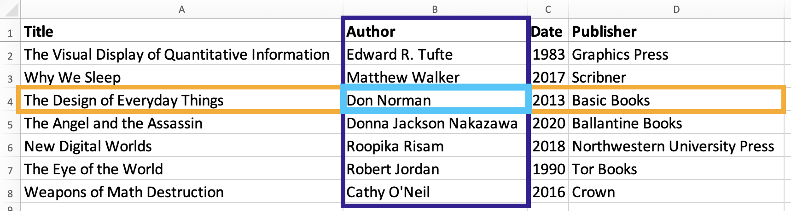

Spreadsheets are a wonderful tool for gathering, viewing, sharing, and working with information. As with any tool, learning to use them effectively can make a big difference. In this tutorial we will discuss the structure of an effective spreadsheet, how to deal with certain tricky values you may work with, and some other tips and features for working with spreadsheets.

!!!! ## Learning Objectives
!!!!
!!!! - Describe the basic structure of a spreadsheet.
!!!! - Determine how to organize a complicated dataset.
!!!! - Avoid common pitfalls when creating tables or spreadsheets.
!!!! - Handle tricky information, like dates and null or unknown values.

## Basic Spreadsheet Structure

We will look at several sample spreadsheets to see how we can organize different types of information. Before we look at anything too complex, however, we need to define the basic "data structure" of a spreadsheet.

The Book Sample spreadsheet is a very basic example of standard table listing books.

!!! A quick note on terminology: I am using spreadsheet and table interchangeably here, since a well-organized spreadsheet is a table.

<table>
    <caption>Book Sample</caption>
    <thead>
        <tr>
            <th>Title</th>
            <th>Author</th>
            <th>Date</th>
            <th>Publisher</th>
        </tr>
    </thead>
    <tbody>
        <tr>
            <td>The Visual Display of Quantitative Information</td>
            <td>Edward R. Tufte</td>
            <td>1983</td>
            <td>Graphics Press</td>
        </tr>
      <tr>
        <td>Why We Sleep</td>
        <td>Matthew Walker</td>
        <td>2017</td>
        <td>Scribner</td>
      </tr>
      <tr>
        <td>The Design of Everyday Things</td>
        <td>Don Norman</td>
        <td>2013</td>
        <td>Basic Books</td>
      </tr>
      <tr>
        <td>The Angel and the Assassin</td>
        <td>Donna Jackson Nakazawa</td>
        <td>2020</td>
        <td>Ballantine Books</td>
      </tr>
      <tr>
        <td>New Digital Worlds</td>
        <td>Roopika Risam</td>
        <td>2018</td>
        <td>Northwestern University Press</td>
      </tr>
      <tr>
        <td>The Eye of the World</td>
        <td>Robert Jordan</td>
        <td>1990</td>
        <td>Tor Books</td>
      </tr>
      <tr>
        <td>Weapons of Math Destruction</td>
        <td>Cathy O’Neil</td>
        <td>2016</td>
        <td>Crown</td>
      </tr>
    </tbody>
</table>

There are three components of table structure that are important to note: Columns, rows, and cells.

A column lists some variable, or type of information. In this sample, that information includes title, author, date, and publisher. We could create more columns if we wanted to collect other information about the books - number of pages, ISBN number, subject, and so forth - anything you can think of that you would want to record.

A row lists one observation, or one "item" that we are observing. That "item" could be anything from an observation from hands-on research to information about a concept or physical object. Often, as is the case here, the first row provides column headers instead. This is important for making it clear what each column contains. In this sample, the items we are listing are books, so each row will contain one (and only one) book. This is one of the essential rules for organized spreadsheets: Each row contains information for only one object.

Each intersection of a row and column is a cell. A cell contains the value of the variable specified by the column for the item specified by the row. For example, the cell highlighted here contains the information specified by the Author for the observation of the third item - the book The Design of Everyday Things. In other words, this cell states that the author of The Design of Everyday Things is Don Norman.

The standard rule here is that there should only ever be one value per cell. While this sample conforms to the rule, there is a potential problem area in the author column. You are probably familiar with lots of books and articles that have more than one author. If I want to add a book with multiple authors to this spreadsheet, I have to choose between ignoring all authors other than the first, having multiple authors (values) in a single cell, or restructuring the sheet. As we will see, the last option is typically the best choice, although it will likely take more work. That is why it is important to plan out what information you have and how you will organize it early!

! ### Key Points
!
! - One value per cell
! - One item per row

Another fairly common attribute that shares the same difficulty as author is the tag attribute. Tweets, photographs, artifacts... all kinds of things can have any number of tags. In the next example, we will take a look at how we can address this kind of issue when it comes up.

The Skyrim Museum Sample is a shortened and simplified version of some information that could be uploaded to the content management system Omeka. Omeka allows you to build a basic website with a searchable database containing images or other objects and their metadata (the information about those objects). It is commonly used for archives, and it works well for a variety of digital projects.

This is an image from the Omeka site showing two of the items it contains. (screenshot) If you are interested, you can [explore the Skyrim Museum site](https://theoacker.oucreate.com/skyrim-museum/items/browse) to get an idea of what Omeka can do.

This site features a collection of items from the video game Skyrim that would be classified as cultural heritage artifacts, at least if they existed in the real world. Our sample dataset contains a few of these items.

<table>
    <caption>Skyrim Museum Sample</caption>
  <thead>
    <tr>
      <th>Name</th>
      <th>Creator</th>
      <th>Date</th>
      <th>Original Format</th>
      <th>Tags</th>
    </tr>
  </thead>
  <tbody>
    <tr>
      <td>Rahgot</td>
      <td>Unknown dragons</td>
      <td>Merethic Era</td>
      <td>Game Object</td>
      <td>armor,dragons,enchanted,Nordic</td>
    </tr>
    <tr>
      <td>Golden Claw</td>
      <td>Unknown</td>
      <td>Unknown</td>
      <td>Game Object</td>
      <td>dragons,Nordic,puzzles</td>
    </tr>
    <tr>
      <td>Mehrunes' Razor</td>
      <td>Mehrunes Dagon</td>
      <td>Unknown</td>
      <td>Game Object</td>
      <td>Daedric,dagger,enchanted,one-handed,weapon</td>
    </tr>
    <tr>
      <td>Auriel's Bow</td>
      <td>Anuiel</td>
      <td>Dawn Era</td>
      <td>Game Object</td>
      <td>bow,enchanted,prophecy,two-handed,weapon</td>
    </tr>
    <tr>
      <td>Wuuthrad</td>
      <td>Yngol</td>
      <td>Merethic Era</td>
      <td>Game Object</td>
      <td>axe,Nordic,two-handed,weapon</td>
    </tr>
  </tbody>
</table>

In this dataset we have name, creator, date, original format, and tags. You may have noticed that the Tags column is breaking the rule of one value per cell. This illustrates one of the rare cases when it is good to break the rule. When uploading this data to Omeka, the Omeka importer will recognize the Tags column and separate out the list of tags as individual items. This means that the end result will not have all the tags mashed together like we see here.

That is great for importing data into Omeka. It is not so great for other potential uses. What if we want to analyze the data outside of Omeka using some other type of software? For a simple example, maybe we want to count how many objects have the "enchanted" tag. It is simple enough to count by hand, since this is such a tiny dataset. In a larger dataset however, I might have closer to five hundred items than five. With such a dataset, there would be no easy way to count the number of objects with any given tag.

Other potential avenues for analysis include:

- How many tags does each item have?
- What are the most common tags?
- Which tags tend to show up together?

With the current structure, we have no reasonable way to get this information.

So what is the solution?

#### Variable List of Generic Columns

The first option we will consider is adding a list of however many generic columns we end up needing, as shown below.

<table>
    <thead>
      <tr>
        <th>Name</th>
        <th>Creator</th>
        <th>Date</th>
        <th>Original Format</th>
        <th>Tag 1</th>
        <th>Tag 2</th>
        <th>Tag 3</th>
        <th>Tag 4</th>
        <th>Tag 5</th>
      </tr>
    </thead>
    <tbody>
      <tr>
        <td>Rahgot</td>
        <td>Unknown dragons</td>
        <td>Merethic Era</td>
        <td>Game Object</td>
        <td>armor</td>
        <td>dragons</td>
        <td>enchanted</td>
        <td>Nordic</td>
        <td></td>
      </tr>
      <tr>
        <td>Golden Claw</td>
        <td>Unknown</td>
        <td>Unknown</td>
        <td>Game Object</td>
        <td>dragons</td>
        <td>Nordic</td>
        <td>puzzles</td>
        <td></td>
        <td></td>
      </tr>
      <tr>
        <td>Mehrunes' Razor</td>
        <td>Mehrunes Dagon</td>
        <td>Unknown</td>
        <td>Game Object</td>
        <td>Daedric</td>
        <td>dagger</td>
        <td>enchanted</td>
        <td>one-handed</td>
        <td>weapon</td>
      </tr>
      <tr>
        <td>Auriel's Bow</td>
        <td>Anuiel</td>
        <td>Dawn Era</td>
        <td>Game Object</td>
        <td>bow</td>
        <td>enchanted</td>
        <td>prophecy</td>
        <td>two-handed</td>
        <td>weapon</td>
      </tr>
      <tr>
        <td>Wuuthrad</td>
        <td>Yngol</td>
        <td>Merethic Era</td>
        <td>Game Object</td>
        <td>axe</td>
        <td>Nordic</td>
        <td>two-handed</td>
        <td>weapon</td>
        <td></td>
      </tr>
    </tbody>
</table>

Here we have created five columns so that each tag is in its own cell and column. There are several major issues with this. First, the number of tags a given object has is variable. At the moment we only need five columns, since the most tags any of these items have is five, but we cannot count on that. We might end up with an item that has ten or even twenty tags. In addition, this structure does not help us at all in analyzing the data. Consider the "simple" question of how many objects have the "enchanted" tag. Again, it is easy enough to count by hand with a dataset of only five objects. If I had a larger dataset and wanted to use some software to find this number, however, it would be rather complicated to explain what I needed to the software. I would have to list out each tag column (Tag 1, Tag 2, Tag 3, and so on) and tell the program to check each of them, as "enchanted" could show up in any of them.

This might seem like a minor hassle with the data we have. Listing the five columns is only slightly annoying, but imagine if there were twenty columns instead, or if we wanted to make a chart showing how many times each tag shows up. While these are not the only issues, they are enough to indicate that this is **_not_** the solution.

#### Long List of Specific Columns

Our second option is a slightly different take on the first. We still create extra columns, but this time we create a specific column for each potential value. In this case, we need a column for each different tag used in the dataset.

<table>
    <thead>
      <tr>
        <th>Name</th>
        <th>Creator</th>
        <th>Date</th>
        <th>Original Format</th>
        <th>armor</th>
        <th>axe</th>
        <th>bow</th>
        <th>Daedric</th>
        <th>dagger</th>
        <th>dragons</th>
        <th>enchanted</th>
        <th>Nordic</th>
        <th>one-handed</th>
        <th>prophecy</th>
        <th>puzzles</th>
        <th>two-handed</th>
        <th>weapon</th>
      </tr>
    </thead>
    <tbody>
      <tr>
        <td>Rahgot</td>
        <td>Unknown dragons</td>
        <td>Merethic Era</td>
        <td>Game Object</td>
        <td>yes</td>
        <td>no</td>
        <td>no</td>
        <td>no</td>
        <td>no</td>
        <td>yes</td>
        <td>yes</td>
        <td>yes</td>
        <td>no</td>
        <td>no</td>
        <td>no</td>
        <td>no</td>
        <td>no</td>
      </tr>
      <tr>
        <td>Golden Claw</td>
        <td>Unknown</td>
        <td>Unknown</td>
        <td>Game Object</td>
        <td>no</td>
        <td>no</td>
        <td>no</td>
        <td>no</td>
        <td>no</td>
        <td>yes</td>
        <td>no</td>
        <td>yes</td>
        <td>no</td>
        <td>no</td>
        <td>yes</td>
        <td>no</td>
        <td>no</td>
      </tr>
      <tr>
        <td>Mehrunes' Razor</td>
        <td>Mehrunes Dagon</td>
        <td>Unknown</td>
        <td>Game Object</td>
        <td>no</td>
        <td>no</td>
        <td>no</td>
        <td>yes</td>
        <td>yes</td>
        <td>no</td>
        <td>yes</td>
        <td>no</td>
        <td>yes</td>
        <td>no</td>
        <td>no</td>
        <td>no</td>
        <td>yes</td>
      </tr>
      <tr>
        <td>Auriel's Bow</td>
        <td>Anuiel</td>
        <td>Dawn Era</td>
        <td>Game Object</td>
        <td>no</td>
        <td>no</td>
        <td>yes</td>
        <td>no</td>
        <td>no</td>
        <td>no</td>
        <td>yes</td>
        <td>no</td>
        <td>no</td>
        <td>yes</td>
        <td>no</td>
        <td>yes</td>
        <td>yes</td>
      </tr>
      <tr>
        <td>Wuuthrad</td>
        <td>Yngol</td>
        <td>Merethic Era</td>
        <td>Game Object</td>
        <td>no</td>
        <td>yes</td>
        <td>no</td>
        <td>no</td>
        <td>no</td>
        <td>no</td>
        <td>no</td>
        <td>yes</td>
        <td>no</td>
        <td>no</td>
        <td>no</td>
        <td>yes</td>
        <td>yes</td>
      </tr>
    </tbody>
</table>

This structure improves our ability to perform some types of analysis, though it causes issues with others. More importantly, however, this is simply not feasible. We have to add one column for each tag. With only five items, each of which has at most only five tags, we already have thirteen different possible tags. With a full dataset, we would have a lot more. There are some cases where adding specific columns like this is a good solution (we will see one in a different example), but this is clearly not one of those.

#### Multiple Spreadsheets

Finally, we have our only real option: Splitting the data into two different spreadsheets/tables.

The first table, Objects, contains all of the artifact information except for tags. In fact, it is literally the same table we started with, but with the Tags column removed.

<table>
    <caption>Objects</caption>
  <thead>
    <tr>
      <th>Name</th>
      <th>Creator</th>
      <th>Date</th>
      <th>Original Format</th>
    </tr>
  </thead>
  <tbody>
    <tr>
      <td>Rahgot</td>
      <td>Unknown dragons</td>
      <td>Merethic Era</td>
      <td>Game Object</td>
    </tr>
    <tr>
      <td>Golden Claw</td>
      <td>Unknown</td>
      <td>Unknown</td>
      <td>Game Object</td>
    </tr>
    <tr>
      <td>Mehrunes' Razor</td>
      <td>Mehrunes Dagon</td>
      <td>Unknown</td>
      <td>Game Object</td>
    </tr>
    <tr>
      <td>Auriel's Bow</td>
      <td>Anuiel</td>
      <td>Dawn Era</td>
      <td>Game Object</td>
    </tr>
    <tr>
      <td>Wuuthrad</td>
      <td>Yngol</td>
      <td>Merethic Era</td>
      <td>Game Object</td>
    </tr>
  </tbody>
</table>

We can then deal with the Tags column in a second spreadsheet. Here, each row pairs one object and one tag. Every object gets one row for each of its tags. For example, Auriel's Bow has five tags, so it gets five rows in this new table.

<table>
    <caption>Tags</caption>
    <thead>
      <tr>
        <th>Name</th>
        <th>Tag</th>
      </tr>
    </thead>
    <tbody>
      <tr>
        <td>Rahgot</td>
        <td>armor</td>
      </tr>
      <tr>
        <td>Rahgot</td>
        <td>dragons</td>
      </tr>
      <tr>
        <td>Rahgot</td>
        <td>enchanted</td>
      </tr>
      <tr>
        <td>Rahgot</td>
        <td>Nordic</td>
      </tr>
      <tr>
        <td>Golden Claw</td>
        <td>dragons</td>
      </tr>
      <tr>
        <td>Golden Claw</td>
        <td>Nordic</td>
      </tr>
      <tr>
        <td>Golden Claw</td>
        <td>puzzles</td>
      </tr>
      <tr>
        <td>Mehrunes' Razor</td>
        <td>Daedric</td>
      </tr>
      <tr>
        <td>Mehrunes' Razor</td>
        <td>dagger</td>
      </tr>
      <tr>
        <td>Mehrunes' Razor</td>
        <td>enchanted</td>
      </tr>
      <tr>
        <td>Mehrunes' Razor</td>
        <td>one-handed</td>
      </tr>
      <tr>
        <td>Mehrunes' Razor</td>
        <td>weapon</td>
      </tr>
      <tr>
        <td>Auriel's Bow</td>
        <td>bow</td>
      </tr>
      <tr>
        <td>Auriel's Bow</td>
        <td>enchanted</td>
      </tr>
      <tr>
        <td>Auriel's Bow</td>
        <td>prophecy</td>
      </tr>
      <tr>
        <td>Auriel's Bow</td>
        <td>two-handed</td>
      </tr>
      <tr>
        <td>Auriel's Bow</td>
        <td>weapon</td>
      </tr>
      <tr>
        <td>Wuuthrad</td>
        <td>axe</td>
      </tr>
      <tr>
        <td>Wuuthrad</td>
        <td>Nordic</td>
      </tr>
      <tr>
        <td>Wuuthrad</td>
        <td>two-handed</td>
      </tr>
      <tr>
        <td>Wuuthrad</td>
        <td>weapon</td>
      </tr>
    </tbody>
</table>

The two spreadsheet connect by using the artifact name. In the fifth row of the Tags table, we pair the Golden Claw with the dragons tag. Then we pair it with Nordic, and then with puzzles. Because the "Name" variable is unique to each of our objects - for example, we only have one object with the name Golden Claw - we can use this to clearly identify which object a given tag belongs to. There is no question that the three tags just mentioned (dragons, Nordic, puzzles) all belong to the object called Golden Claw.

### Survey Data

Our next example is a spreadsheet based on some actual survey data I worked with. I am providing two tables here - the short version, so you can view it more easily, and the long version.

<table>
    <caption>Survey Data - "Short" Version</caption>
    <thead>
      <tr>
        <th>HHID</th>
        <th>Year</th>
        <th>Month</th>
        <th>Day</th>
        <th>RegionCode</th>
        <th>Livestock</th>
        <th>Members</th>
        <th>ID_01</th>
        <th>ID_02</th>
        <th>ID_03</th>
        <th>ID_04</th>
        <th>ID_05</th>
        <th>ID_06</th>
        <th>ID_07</th>
        <th>ID_08</th>
        <th>ID_09</th>
        <th>ID_10</th>
        <th>ID_11</th>
        <th>ID_12</th>
        <th>Age_01</th>
      </tr>
    </thead>
    <tbody>
      <tr>
        <td>1</td>
        <td>2019</td>
        <td>3</td>
        <td>25</td>
        <td>15874</td>
        <td>1 poultry</td>
        <td>4</td>
        <td>1</td>
        <td>2</td>
        <td>3</td>
        <td>4</td>
        <td></td>
        <td></td>
        <td></td>
        <td></td>
        <td></td>
        <td></td>
        <td></td>
        <td></td>
        <td>34</td>
      </tr>
      <tr>
        <td>2</td>
        <td>2019</td>
        <td>3</td>
        <td>25</td>
        <td>15874</td>
        <td>2 cows, 1 ox</td>
        <td>4</td>
        <td>1</td>
        <td>2</td>
        <td>3</td>
        <td>4</td>
        <td></td>
        <td></td>
        <td></td>
        <td></td>
        <td></td>
        <td></td>
        <td></td>
        <td></td>
        <td>20</td>
      </tr>
      <tr>
        <td>3</td>
        <td>2019</td>
        <td>3</td>
        <td>27</td>
        <td>15874</td>
        <td>5 poultry, 2 cows, 2 goats, 1 ox</td>
        <td>4</td>
        <td>1</td>
        <td>2</td>
        <td>3</td>
        <td>4</td>
        <td></td>
        <td></td>
        <td></td>
        <td></td>
        <td></td>
        <td></td>
        <td></td>
        <td></td>
        <td>42</td>
      </tr>
      <tr>
        <td>4</td>
        <td>2019</td>
        <td>3</td>
        <td>28</td>
        <td>10553</td>
        <td>3 cows, 1 ox</td>
        <td>5</td>
        <td>1</td>
        <td>2</td>
        <td>3</td>
        <td>4</td>
        <td>5</td>
        <td></td>
        <td></td>
        <td></td>
        <td></td>
        <td></td>
        <td></td>
        <td></td>
        <td>40</td>
      </tr>
      <tr>
        <td>5</td>
        <td>2019</td>
        <td>3</td>
        <td>30</td>
        <td>10553</td>
        <td>1 goat</td>
        <td>2</td>
        <td>1</td>
        <td>2</td>
        <td></td>
        <td></td>
        <td></td>
        <td></td>
        <td></td>
        <td></td>
        <td></td>
        <td></td>
        <td></td>
        <td></td>
        <td>27</td>
      </tr>
      <tr>
        <td>6</td>
        <td>2019</td>
        <td>4</td>
        <td>2</td>
        <td>10553</td>
        <td>1 ox</td>
        <td>6</td>
        <td>1</td>
        <td>2</td>
        <td>3</td>
        <td>4</td>
        <td>5</td>
        <td>6</td>
        <td></td>
        <td></td>
        <td></td>
        <td></td>
        <td></td>
        <td></td>
        <td>30</td>
      </tr>
      <tr>
        <td>7</td>
        <td>2019</td>
        <td>4</td>
        <td>2</td>
        <td>10553</td>
        <td>1 goat, 1 ox</td>
        <td>4</td>
        <td>1</td>
        <td>2</td>
        <td>3</td>
        <td>4</td>
        <td></td>
        <td></td>
        <td></td>
        <td></td>
        <td></td>
        <td></td>
        <td></td>
        <td></td>
        <td>57</td>
      </tr>
      <tr>
        <td>8</td>
        <td>2019</td>
        <td>4</td>
        <td>2</td>
        <td>10553</td>
        <td>2 goats, 1 ox</td>
        <td>12</td>
        <td>1</td>
        <td>2</td>
        <td>3</td>
        <td>4</td>
        <td>5</td>
        <td>6</td>
        <td>7</td>
        <td>8</td>
        <td>9</td>
        <td>10</td>
        <td>11</td>
        <td>12</td>
        <td>67</td>
      </tr>
      <tr>
        <td>9</td>
        <td>2019</td>
        <td>4</td>
        <td>3</td>
        <td>10553</td>
        <td>2 oxen</td>
        <td>1</td>
        <td>1</td>
        <td></td>
        <td></td>
        <td></td>
        <td></td>
        <td></td>
        <td></td>
        <td></td>
        <td></td>
        <td></td>
        <td></td>
        <td></td>
        <td>65</td>
      </tr>
      <tr>
        <td>10</td>
        <td>2019</td>
        <td>4</td>
        <td>3</td>
        <td>14521</td>
        <td>1 cow, 2 goats</td>
        <td>3</td>
        <td>1</td>
        <td>2</td>
        <td>3</td>
        <td></td>
        <td></td>
        <td></td>
        <td></td>
        <td></td>
        <td></td>
        <td></td>
        <td></td>
        <td></td>
        <td>33</td>
      </tr>
      <tr>
        <td>11</td>
        <td>2019</td>
        <td>4</td>
        <td>4</td>
        <td>14521</td>
        <td>3 poultry, 1 goat</td>
        <td>4</td>
        <td>1</td>
        <td>2</td>
        <td>3</td>
        <td>4</td>
        <td></td>
        <td></td>
        <td></td>
        <td></td>
        <td></td>
        <td></td>
        <td></td>
        <td></td>
        <td>37</td>
      </tr>
      <tr>
        <td>12</td>
        <td>2019</td>
        <td>4</td>
        <td>4</td>
        <td>14521</td>
        <td>2 poultry, 1 cow, 1 goat</td>
        <td>4</td>
        <td>1</td>
        <td>2</td>
        <td>3</td>
        <td>4</td>
        <td></td>
        <td></td>
        <td></td>
        <td></td>
        <td></td>
        <td></td>
        <td></td>
        <td></td>
        <td>43</td>
      </tr>
      <tr>
        <td>13</td>
        <td>2019</td>
        <td>4</td>
        <td>4</td>
        <td>16354</td>
        <td>1 cow, 1 ox</td>
        <td>4</td>
        <td>1</td>
        <td>2</td>
        <td>3</td>
        <td>4</td>
        <td></td>
        <td></td>
        <td></td>
        <td></td>
        <td></td>
        <td></td>
        <td></td>
        <td></td>
        <td>40</td>
      </tr>
      <tr>
        <td>14</td>
        <td>2019</td>
        <td>4</td>
        <td>4</td>
        <td>16354</td>
        <td>3 poultry</td>
        <td>7</td>
        <td>1</td>
        <td>2</td>
        <td>3</td>
        <td>4</td>
        <td>5</td>
        <td>6</td>
        <td>7</td>
        <td></td>
        <td></td>
        <td></td>
        <td></td>
        <td></td>
        <td>29</td>
      </tr>
      <tr>
        <td>15</td>
        <td>2019</td>
        <td>4</td>
        <td>7</td>
        <td>16354</td>
        <td>2 goats, 1 ox</td>
        <td>7</td>
        <td>1</td>
        <td>2</td>
        <td>3</td>
        <td>4</td>
        <td>5</td>
        <td>6</td>
        <td>7</td>
        <td></td>
        <td></td>
        <td></td>
        <td></td>
        <td></td>
        <td>41</td>
      </tr>
      <tr>
        <td>16</td>
        <td>2019</td>
        <td>4</td>
        <td>7</td>
        <td>16354</td>
        <td>3 cows, 1 ox</td>
        <td>16</td>
        <td>1</td>
        <td>2</td>
        <td>3</td>
        <td></td>
        <td></td>
        <td></td>
        <td></td>
        <td></td>
        <td></td>
        <td></td>
        <td></td>
        <td></td>
        <td>31</td>
      </tr>
    </tbody>
</table>